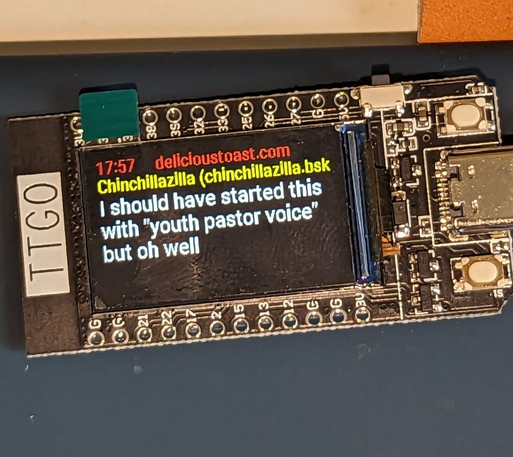

# bluesky_esphome

Basic ESPHOME / c++ / ESP32 configuration to display some Bluesky / atproto content

Copyright (c) 2023 John Mueller

[github](https://github.com/softplus) - [blog](https://johnmu.com/) - [Bluesky](https://staging.bsky.app/profile/did:plc:7gokebwtnp56e7ngbepyamnr)

MIT license

# Setup

[ESPHOME](https://esphome.io/) is a framework for creating ESP-32 and ESP-8266 IoT devices. It integrates well with [Home Assistant](https://www.home-assistant.io/).
[Installing and setting up](https://esphome.io/guides/installing_esphome.html) is well-documented (and I'm lazy).

The devices are programmed using a "yaml" file. In this case, we have a bunch of c++ code in the yaml file too.

# Hardware

The file here was created for LILYGO [TTGO T-Display](https://www.lilygo.cc/products/lilygo%C2%AE-ttgo-t-display-1-14-inch-lcd-esp32-control-board) boards. They're either battery or USB-C powered. You program them via USB.

You can get them in various places, including [Aliexpress](https://s.click.aliexpress.com/e/_DCHPZAZ) - they're around USD 8 - 15.00. 

# Configuration

Copy `secrets-example.yaml` to `secrets.yaml`, and `secrets-example.bluesky.yaml` to `secrets.bluesky.yaml`. These are the configuration files.

Edit the files in a text editor:

* `secrets.yaml`: Set `wifi_ssid` and `wifi_password`, you can leave the rest as-is.
* Get an app password in Bluesky: "Settings" / "App passwords" / "Add App Password". 
* `secrets.bluesky.yaml`: set `bluesky_account` to your username, and `bluesky_token` to the app password you generated. Use your DID as account name, if you feel like changing it often.

# Upload and enjoy

```bash
esphome run ttgo_bluesky.yaml
```

Once uploaded, you don't need to keep the device connected to your computer -- it uses wifi to connect to the internet and to the blue sky.



# Notes

* Code is not very optimized or clean, it works, whatever.
* It uses an undocumented feed for "What's Hot": `app.bsky.unspecced.getPopular` - maybe this will dry up at some point.
* I'll change to a documented feed when needed.
* It also publishes to Home-Assistant, if you have that set up.
* I don't have any invites, sorry :-(
